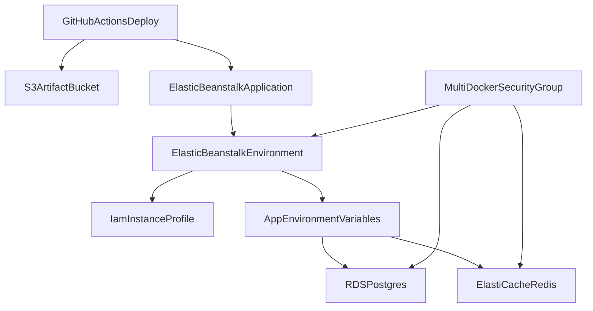

# Architecture Map

This Terraform stack creates a disposable AWS environment for the monorepo deployment model from `docker-compose.yml` and `.github/workflows/deploy.yaml`.

## Flow

- GitHub Actions builds/pushes images and uploads a deployment zip to Elastic Beanstalk.
- Elastic Beanstalk runs the multi-container environment.
- Server/worker container env vars point to Terraform-created Redis and Postgres endpoints.
- One shared security group allows internal app-to-data traffic on ports `5432-6379`.

## Learning focus

- Terraform graph ordering: IAM and data services are created before the app environment uses them.
- Reproducibility: outputs provide the exact values needed by your deploy workflow.
- Clean teardown: resources are configured to support `terraform destroy` in lab scenarios.
